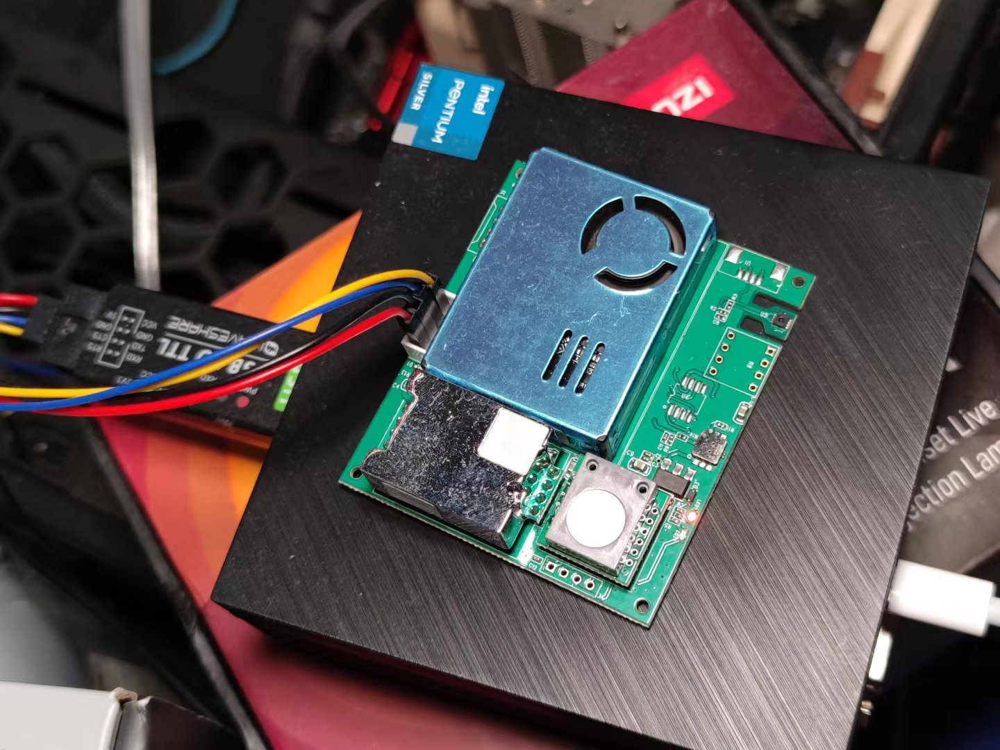
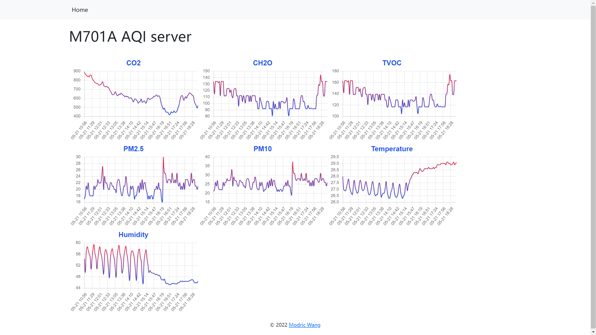

# M701A_server

## Environment

### Lite Version
- Raspberry 4b 
- M701 sensor with UART
- Ubuntu 20.10
- Python - Miniforge3

### Pro Version
- x86_64 CPU
- M701 sensor with UART
- UART to USB converter
- Windows 11 
- Python - Anaconda3 

// Not Tested on any Windows ARM / macOS environment, but I will try it later. 

## Preparation

### Common preparations

```shell
pip install requirements.txt 
```

### For Lite Version

#### Turn on UART0 port
refer to: 
https://www.icode9.com/content-4-1055041.html

! Remember to turn off bluetooth

#### connect the sensor to UART0 physical port

Don't as me more about this. I just know this way works. ;)

#### change UART0 port permissions
if your UART0 port mapping is '/dev/ttyAMA0':
```shell
sudo chmod 666 /dev/ttyAMA0 
```

### For Pro Version

#### connect via a UART-USB converter



#### set powershell policy
```powershell
Set-ExecutionPolicy RemoteSigned -Scope CurrentUser
```

## Run DB

### For Lite Version

```bash
cd m701a
sh run_db.sh
```

### For Pro Version

```powershell
cd m701a
.\run_db.ps1
```

## Run Server

### For Lite Version

```bash
cd web_host
sh run_web_host.sh
```

### For Pro Version

```powershell
cd web_host
.\run_web_host.ps1
```

## open in browser
http://XX.XX.XX.XX:XXXX
